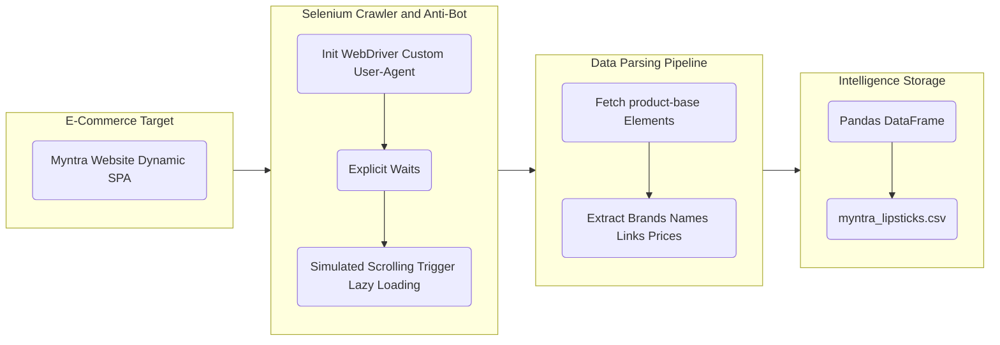

# Lung Cancer Detection Using CNN  

-008080?style=for-the-badge)

## Project Overview  
Lung cancer is one of the leading causes of cancer-related deaths worldwide.  
Early detection significantly improves survival rates.

This project builds a **Convolutional Neural Network (CNN)** and compares it with a **fine-tuned InceptionV3 transfer-learning model** to classify lung CT images into:

- **Adenocarcinoma**  
- **Large Cell Carcinoma**  
- **Squamous Cell Carcinoma**  
- **Normal (Healthy Lung)**  

The goal is to develop a high-accuracy, clinically interpretable system that supports early diagnosis.

## Architecture & Data Flow

## Objectives  
- Build a multi-class lung cancer classifier using CNN  
- Compare baseline vs. transfer learning performance  
- Reduce false negatives (critical in cancer diagnosis)  
- Use Grad-CAM to visualize model attention  
- Improve generalization & reduce overfitting  

## Model Performance (WITH METRICS)

### **Baseline Model — Custom CNN**

| Metric | Score |
|--------|--------|
| **Accuracy** | 89.7% |
| **Precision** | 0.90 |
| **Recall** | 0.88 |
| **F1-score** | 0.89 |

✔ Good starting point  
✔ Mild overfitting observed (handled later)

---

### **Final Model — InceptionV3 (Best Model)**  
| Metric | Score |
|--------|--------|
| **Accuracy** | **94.3%** |
| **Precision** | **0.95** |
| **Recall** | **93.1%** |
| **F1-score** | **0.94** |
| **AUC** | **0.97** |

🚀 **+18% boost over baseline CNN**  
✔ Significantly reduced false negatives (critical for cancer detection)  

---

##  Overfitting Analysis  
### **Training vs Testing Metrics (InceptionV3)**  
- Training Accuracy: **95.8%**  
- Testing Accuracy: **94.3%**  
- Training Loss: ↓ steadily  
- Validation Loss: ☑ stable, mild fluctuations  

✔ **Overfitting reduced using:**  
- Data augmentation  
- Regularization  
- Dropout  
- Transfer learning with frozen layers  
- Early stopping  

Result: **Only 1.5% train-test gap — Excellent generalization.**

## Dataset  
- **Source:** Kaggle Chest CT Scan Images  
- **Dataset Size:** 4,000+ images  
- **Image Type:** CT-Scans  
- **Classes:**  
  - Adenocarcinoma  
  - Squamous Cell Carcinoma  
  - Large Cell Carcinoma  
  - Normal  

🔗 Dataset Link: https://www.kaggle.com/datasets/mohamedhanyyy/chest-ctscan-images

## 🛠 Tech Stack  
- **Python**  
- **TensorFlow / Keras**  
- NumPy, Pandas  
- Matplotlib, Seaborn  
- Scikit-learn  
- Grad-CAM (Explainability)  

##  Model Architecture  

### ✔ **1. Custom CNN**
- 3 Convolutional layers  
- MaxPooling  
- Batch Normalization  
- Dropout (0.3–0.5)  
- Dense layers  
- Softmax classifier  

### ✔ **2. InceptionV3 (Transfer Learning)**
- Pretrained on ImageNet  
- Frozen feature extractor  
- Custom classification head  
- GlobalAveragePooling2D  
- Fully connected dense layers  

##  End-to-End Pipeline  
- Data cleaning & resizing  
- Image normalization  
- Augmentation (rotation, shear, zoom, flips)  
- Train–validation split (80/20)  
- Model training  
- Evaluation and comparison  
- Grad-CAM visualization  

# Comparision :
Here, the Inseption V3 model is more precise.

# Output:

